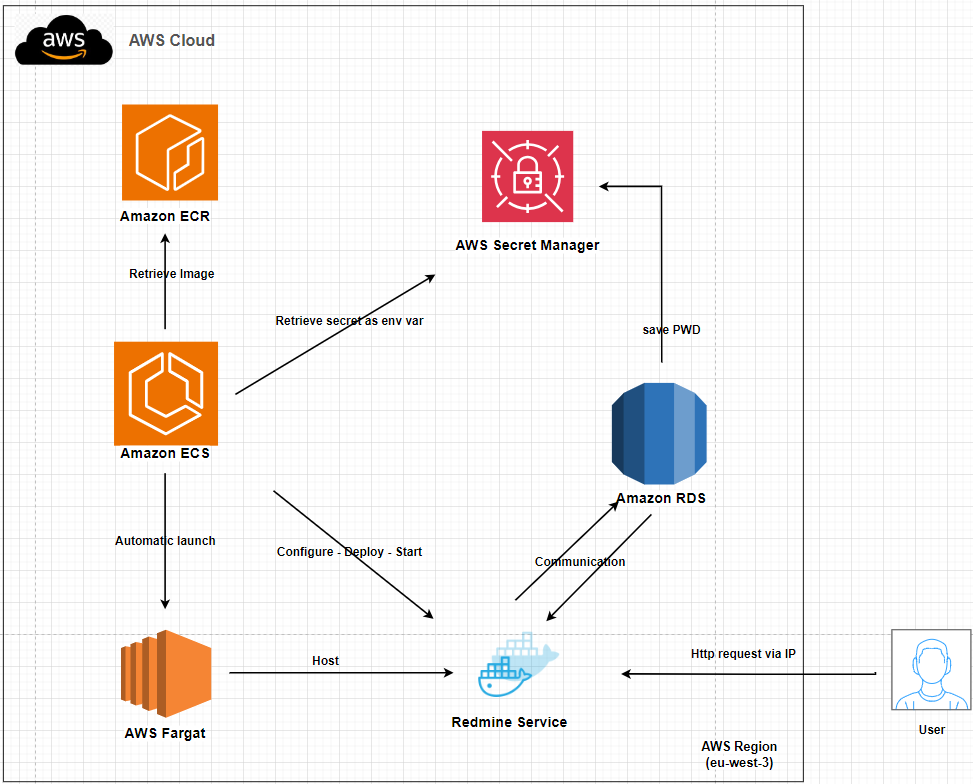

# Topic 5 - Docker container website(service) using Database(ECS+FARGATE+RDS)
##  Yuanchao Hands-on Project

## This readme is more readable [here](https://github.com/lyc-handson-aws/handson-topic5)

## **Overview** 

**Project's main features**

:point_right:  a Redmine website of a docker container hosted on Amazon ECS

:point_right: the container's image is from Amazon ECR

:point_right: Redmine store the necessary info in a Postgres DB

:point_right: about [Redmine](https://www.redmine.org/)

## **Architecture**

the diagram below illustrates the architecture(principle) of this project:

## Continue Deployment

CloudFormation stack's deployment: see GitHub workflows https://github.com/lyc-handson-aws/handson-topic5/blob/main/.github/workflows/action-cf.yaml

## **CloudFormation Stack Quick-create Link**

Click here to quickly create a same project with the same AWS resources:  [here](https://eu-west-3.console.aws.amazon.com/cloudformation/home?region=eu-west-3#/stacks/create/review?templateURL=https://s3bucket-handson-topic1.s3.eu-west-3.amazonaws.com/CF-template-handson-topic5.yaml)

**Some names/vars are particularly defined for Redmine image, pls change them if you want to use another image**

**See Stack's description for complete actions to reproduce the same project**

> the default stack's region "Europe (Paris) eu-west-3"

## **AWS Resources**

Project's AWS resources:

:point_right: AWS::ECS::Cluster - Cluster basic configuration

:point_right: AWS::SecretsManager::Secret

- Store Postgre master password

:point_right: AWS::RDS::DBInstance

- Postgres infra's configuration
- AWS::RDS::OptionGroup - DB version's configuration

:point_right: AWS::ECS::TaskDefinition

- Define container service unit param:
- Define required/limit CPU/MEM
- Define used image, port mapping , env vars
- Define log configuration with CloudWatch

:point_right:AWS::ECS::Service

- Launch container service

- Define container service desired count

- Define container service's infra type: Fargate

- Assign pubic IP to Fargate managed server

:point_right:AWS::IAM::Role

- one - AWS built-in policy "AmazonECSTaskExecutionRolePolicy" for task definition to be able to retrieve image from ECR + permission to retrieve Posrgres pwd from Secrets manager
- one - necessary permissions on CloudWatch for Postgres' logs

